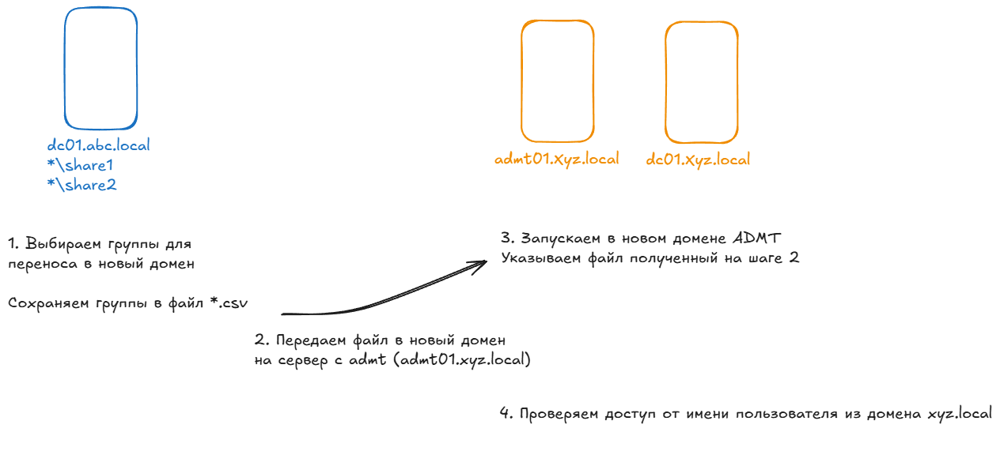

# Миграция групп с ADMT
## 1. Подготовка стенда
Узлы на стенде:
* dc01.abc.local - контроллер в домене из которого переносим группы (старый домен)
* dc01.xyz.local - контроллер домена в который переносим группы (новый домен)
* admt01.xyz.local - сервер с установленным ADMT (новый домен)

### Подготовка сервера 'dc01.abc.local'  
Адрес: 172.16.4.11
```
#
# Windows PowerShell script for AD DS Deployment
#

Import-Module ADDSDeployment
Install-ADDSForest `
-CreateDnsDelegation:$false `
-DatabasePath "C:\ADDS\NTDS" `
-DomainMode "WinThreshold" `
-DomainName "abc.local" `
-DomainNetbiosName "ABC" `
-ForestMode "WinThreshold" `
-InstallDns:$true `
-LogPath "C:\ADDS\LOG" `
-NoRebootOnCompletion:$false `
-SysvolPath "C:\ADDS\SYSVOL" `
-Force:$true
```

### Подготовка сервера 'dc01.xyz.local'  
Адрес: 172.16.5.11
```
#
# Windows PowerShell script for AD DS Deployment
#

Import-Module ADDSDeployment
Install-ADDSForest `
-CreateDnsDelegation:$false `
-DatabasePath "C:\ADDS\NTDS" `
-DomainMode "WinThreshold" `
-DomainName "abc.local" `
-DomainNetbiosName "ABC" `
-ForestMode "WinThreshold" `
-InstallDns:$true `
-LogPath "C:\ADDS\LOG" `
-NoRebootOnCompletion:$false `
-SysvolPath "C:\ADDS\SYSVOL" `
-Force:$true
```

## 1. Создаем список групп на миграцию и сохраняем в формате *.csv
Запускаем скрипт с сключом `-csvOnly`
```
.\Create-GroupsFromACL.ps1 -dirRootPath C:\Admin\ -dstOU "OU=test,OU=ADDS,DC=ds,DC=itallow,DC=ru" -csvOnly
```
## 2.